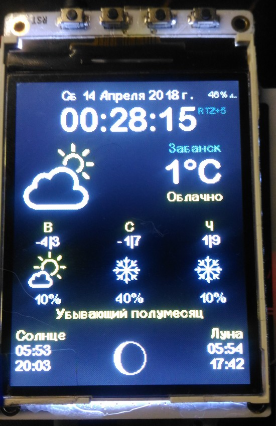

# Color-Weather-Station
 
 
Это форк https://github.com/ThingPulse/esp8266-weather-station для русскоговорящих пользователей

Изначально предназначался для платформы TTGO TM MUSIC (ESP32),

но в процессе роста стало возможно использовать на обеих (ESP32/ESP8266) платформах,

и как двуязычную (RU/ENG)

